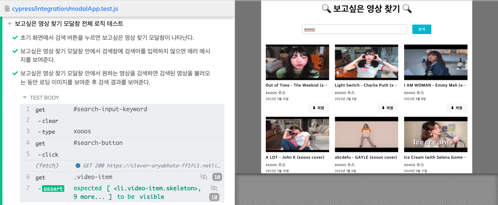
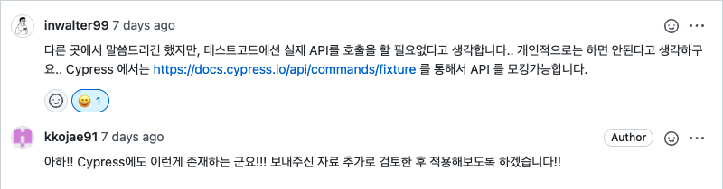
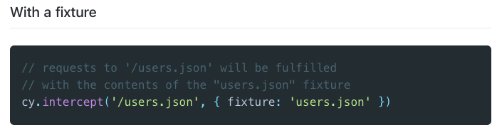
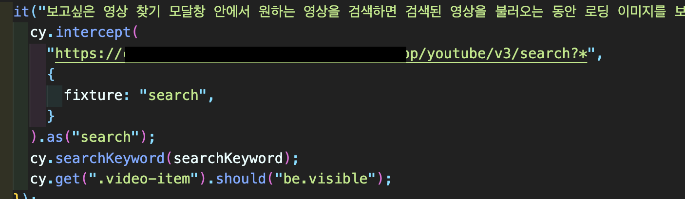
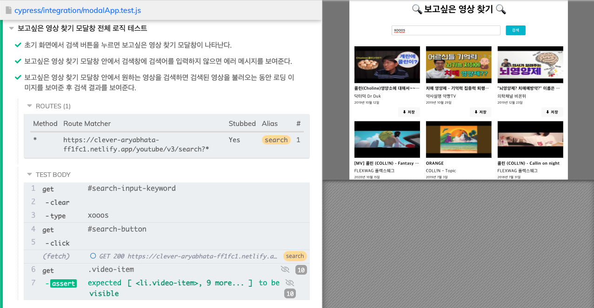
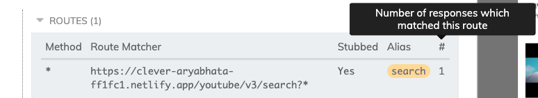

# Cypress에서 API 모킹 하기

---

## 1. 발생한 문제..😡

---

나만의 유튜브 강의실 미션중 마주한 문제이다..

우선 상황은 이렇다!
Youtube API 키를 사용해서 검색된 결과의 동영상의 정보를 가지고와 검색된 결과의 타이틀, 썸네일을 보여주는 작업을 하고 있었다.
문제는 Youtube API 호출 횟 수가 제한적이라는 것인데... 굉장히 굉장히 제한이 되어 있어 검색을 여러번 하면 한도가 초과되었다는 Error Message를 받는 상황이다.

프로젝트에서 API 호출은 정상적으로 이뤄지고, E2E test를 할 때는 호출된 API를 모킹해 미리 준비한 데이터로 갈아끼우는 작업을 해보고 싶었다.

유튜브에서 xooos를 검색한 결과의 이미지는 아래와 같다.

내가 기대하는건 실제 유튜브에서 검색된 결과로 E2E test를 하는 것이 아닌, API 호출이 일어나지 않고 내가 준비둔 목데이터로 갈아끼워 E2E test를 하는 것이다.

## 2. 해결하기 위해..😵‍💫

---

정말, 혼자서 2일 정도 끙끙 앓아가면서 문제를 해결하려고 했다..🥲

리뷰어님이 키워드로 알려주신 fixture..

또 다시 알려주신 키워드 route

cypress 공식문서, youtube 동영상으로 시청 등등.... 여러가지 시도를 해봤던 것 같다.
결론은 우테코 코치인 공원의 지도 하에 마무리를 할 수 있었다.

정답을 다 찾아놓고 주의를 빙빙돌고 있었던 나다...

사용 방법은 간단..!

리뷰어님이 주신 키워드 route는 Cypress 공식 문서에 cypress 6버전부터는 업데이트를 하지 않을 예정이니, intercept를 사용하라는 문구가 적혀 있어, intercept를 사용했다.

실제 내가 작성한 코드는 아래와 같다.

## 3. 정상적으로 모킹이 된다..! 😎

---

내가 기대했던 상황을 다시 말하자면,
프로젝트에서 API 호출은 정상적으로 이뤄지고, E2E test를 할 때는 호출된 API를 모킹해 미리 준비한 데이터로 갈아끼우는 작업!

검색은 xooos로 하지만, 검색 결과는 미리 준비해둔 목 데이터로 갈아 끼워졌다!!!

여기서 추가로 확인할 수 있는 부분에 대해 말을 하자면,
cypress test를 open해서 확인하면 Routes(1) 부분의 토글 버튼을 열어보면
`Method`, `Route Matcher`, `Stubbed`, `Alias`, `#` 컬럼 명들이 보인다.

중요한 포인트는 Route Matcher가 잘 설정되었는지 확인해주어야 하고,
Stubbed 가 잘 되었는지..! Stub이 이뤄지지 않으면 Yes가 아닌 No가 출력된다.
마지막으로 `#`에 나오는 1의 숫자는 해당하는 주소가 몇번 일치했는지 확인할 수 있다. `#`이 부분도 `-` 표시가 나온다면 정상적으로 동작하지 않은 것이다.

끗

> 참고자료: [cypress-fixture](https://docs.cypress.io/api/commands/fixture), [cypress-intercept](https://docs.cypress.io/api/commands/intercept#Stubbing-a-response)
