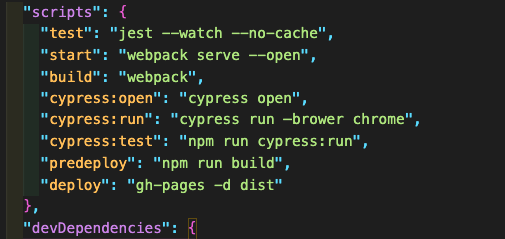
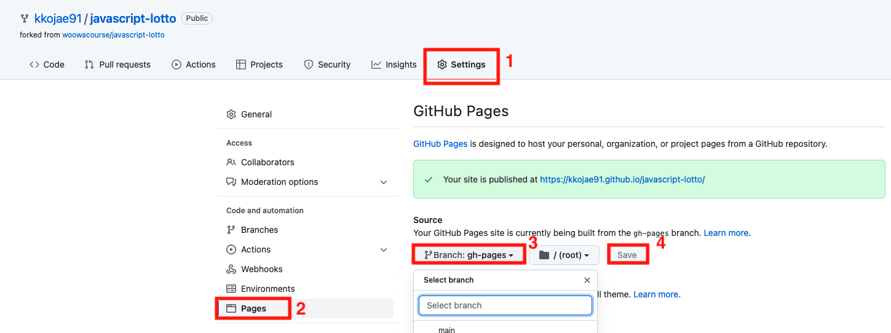
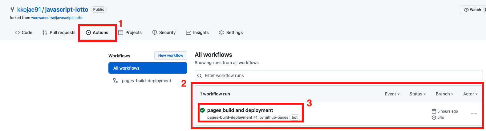

# github pages 무료 배포하기

1. gh-pages를 설치한다.

```bash
npm install gh-pages
```

2. package.json 파일 수정한다.

- scripts에 아래 코드 추가 (dist는 빌드된 파일 모여있는 디렉터리 파일명은 변경될 수 있음)

```json
"scripts" : {
  ...
  "predeploy": "npm run build",
  "deploy": "gh-pages -d dist"
  ...
}
```



3. 터미널에서 npm run deploy 명령어 실행

```bash
npm run deploy
```

4. github 해당 레포지터리로 이동
5. 레포지터리 settings 클릭(이미지 1번)
6. 좌측 pages 클릭 (이미지 2번)
7. Source에 branch 클릭 (default: none) (이미지 3번)
8. branch: none -> gh-pages로 변경 (이미지 3번)
9. save 버튼 클릭 (이미지 4번)



10. Actions 클릭 (이미지 1번)
11. 페이지 배포 확인 (이미지 2번)
12. 초록불이면 배포 완료 배포 중일 경우 주황불 (이미지 3번)
    
