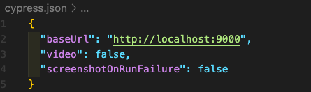

# Jest, Cypress와 함께 단위(Unit) 테스트, E2E 테스트시 발생할 수 있는 문제!

---

### 1. 발생한 문제.. 😡

---

행운의 로또 미션을 jest로 단위 테스트를 작성하고 주요 기능을 구현한 후 페어인 `도리`와 cypress로 E2E 테스트를 작성하고 UI 기능 구현을 하기로 했었다.  
 

순조롭게 cypress로 E2E 테스트 작성하고 UI 기능을 모두 구현!!  
 

cypress 테스트는 모두 통과!!  
하지만, jest 테스트를 돌려봤더니.. 초록불이 였던 테스트에 빨간불이 들어왔다. 🥲  
 

모두 초록불인 것을 확인하고 E2E 테스트 코드를 작성했는데.. 하고 에러 메시지를 확인하니, jest 테스트에서 cypress 테스트 코드를 읽어드리면서 발생하는 에러 메시지인 것을 확인하게 되었다.  
 

- jest는 jest 테스트 코드만,,, cypress는 cypress 테스트 코드만 읽어줄 순 없니..?  
     

### 2. 해결하기 위해.. 😵‍💫

---

위 문제를 해결하기 위해 바로 공식문서를 확인했다면.. 조금 더 빠른 해결을 했을 수도 있을 것 같다. 이리 저리 찾아보던 중 jest 공식문서에 configuring을 확인 해보면 좋다 생각해서 공식문서를 확인했더니...  
 

**jest 공식 홈페이지에서 Configuring Jest안에 testPathIgnorePatterns를 확인**할 수 있었다.  
 

**testPathIgnorePatterns**의 내용은 아래와 같다.

- 기본값 : \["/node_modules/"\]
- 테스트 경로가 정규 표현식 패턴 문자열 배열과 일치하는 경로가 있다면 건너뛴다.
- 위 패턴 문자열은 전체 경로를 기준으로 확인하는데, 프로젝트의 루트 디렉터리가 서로 다른 환경에 있는 모든 파일을 실수로 무시하지 않도록 하려면 **`<rootDir>`문자열 토큰을 사용하여 프로젝트의 루트 디렉터리에 대한 경로를 포함**하라고 나와있다.
- 친절하게 작성하는 예시가 있다.
  - 예) \["`<rootDir>/build/`", "`<rootDir>/node_modules/`"\]
- package.json 파일안에 아래와 같이 **"testPathIgnorePatterns": \["`<rootDir>`/해당 디렉토리/"\]**를 적어주면 설정!

- 추가적으로 cypress.json에 `"baseUrl": "http://localhost:9000",` baseUrl을 해당하는 포트 번호로 설정해주면 끝!!

   

### 3\. 정상적으로 동작.. 😎

---

- 짠!

- 혹시나, 위 코드를 삽입했지만 제대로 동작하지 않았을 경우!! 터미널에서 아래 명령어를 실행하고 확인해보자!

  

### 4\. Unit 테스트와 E2E 테스트를 jest로 하면 안되는 것인가..? 😯

---

결론부터 이야기 하자면, jest로도 E2E 테스트를 할 수 있다. (불편함을 감수 할 수 있다면..)
  

그렇다면, jest를 사용해서 E2E 테스트를 하면 어떤점이 불편하다는 것인가?

1. jest는 실제 브라우저가 아닌, JSDom을 이용한 가상의 브라우저 환경에서 실행된다. (예를 들어, 브라우저의 렌더링 엔진을 사용할 수 없기 때문에 실제 렌더링된 결과인 픽셀 정보를 받아올 수 없다.)
2. jest로 E2E 테스트를 한다면 디버깅이 불편하다.

- 물론, jest의 cli 환경은 상당히 강력해서 테스트가 실패했을 때 꽤나 유용한 정보를 제공한다. 하지만, 실제 화면에 표시된 UI를 볼 수 없다는 점이다.. (실패한 이유를 찾으려면 console.log를 열심히 찍어 봐야한다.)

반면에, cypress를 이용해 E2E테스트를 한다면 실제 화면에 표시된 UI를 보면서 코드를 작성하거나 디버깅을 할 수 있다.
 
뿐만 아니라 테스트를 위해 실행한 모든 명령과 해당 시점의 애플리케이션 상태가 명령 로그에 모두 기록되기 때문에, 마치 녹화된 비디오를 돌려보듯이 쉽게 디버깅을 할 수 있다. 또한 브라우저의 개발자 도구를 그대로 사용할 수 있기 때문에 console.log에 의지하는 것보다 더 좋은 환경에서 디버깅을 할 수 있다.
  

그럼에도 불구하고, jest를 사용해야한다면, 사용해도 좋다!
   

_같은 문제를 겪는 누군가에게 도움이 되기를 바라며.._

   

> 참고 자료 1 : [jest 공식문서](https://jestjs.io/docs/configuration#testpathignorepatterns-arraystring)

 

> 참고 자료 2 : [실용적인 프론트엔드 테스트 전략 (3)](https://meetup.toast.com/posts/180)
