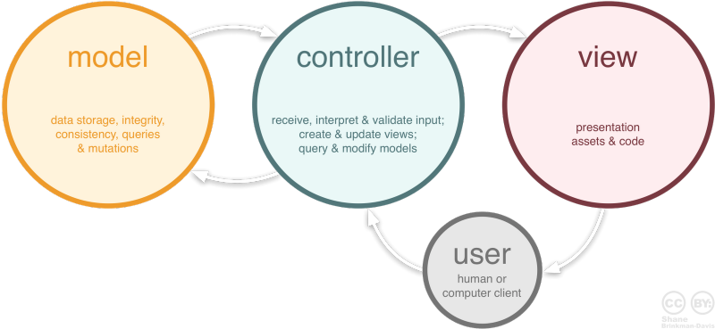

# MVC(Model-View-Controller) Pattern (추가적인 정리 필요!!)

- wikipedia 정의

  - MVC는 관련 프로그램 로직을 3개의 상호 연결된 요소로 나누는 사용자 인터페이스를 개발하는데 일반적으로 사용되는 소프트웨어 디자인 패턴 입니다.

  

- Model (모델)

  > 애플리케이션의 정보, 데이터를 나타낸다. 즉, 데이터 정보들의 가공을 책임지는 컴포넌트를 말한다.

- View (뷰)

  > 사용자 인터페이스 요소를 나타낸다. 즉, 화면에 나타나는 것들을 책임진다.

- Controller (컨트롤러)
  > Model과 view의 다리 역할을 한다. 즉, 사용자가 데이터를 클릭하고 수정하는 것에 대한 '이벤트'들을 책임진다.

## MVC 패턴을 사용하는 이유

- 사용자가 보는 페이지, 데이터 처리, 그리고 이 2가지를 중간에서 제어하는 컨트롤, 이렇게 3가지로 각자 맡은바에만 집중할 수 있게 애플리케이션을 만든다면, 유지보수성, 애플리케이션의 확장성, 그리고 유연성이 증가하고, 중복 코딩의 문제점을 줄일 수 있다는 장점이 있기 때문
