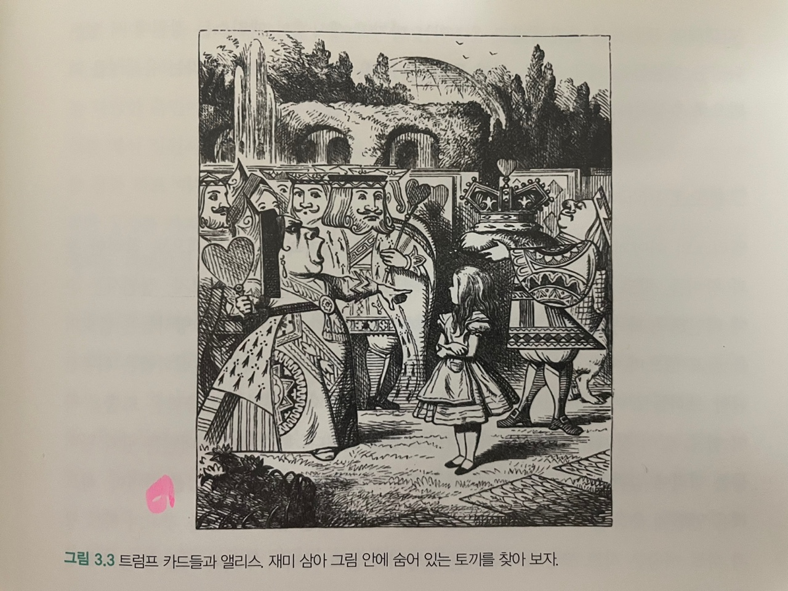
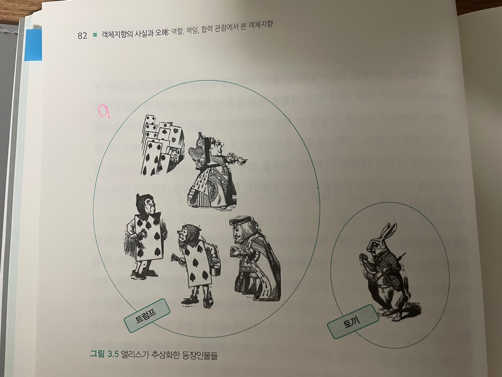

# 03. 타입과 추상화

---

## 1. 추상화를 통한 복잡성 극복

---

현실은 복잡하며 예측 불가능한 혼돈의 덩어리다. 우리가 현실에 존재하는 다양한 현상 및 사물과 상호작용하기 위해서는 우선 현실을 이해해야 한다.
 
문제는 복잡성의 총체인 현실이라는 괴물을 그대로 수용하기에는 인간이 지니고 있는 인지 능력과 저장 공간이 너무나도 보잘것없다는 점이다.
 
따라서 사람들은 본능적으로 이해하기 쉽고 예측 가능한 수준으로 현실을 분해하고 단순화하는 전략을 따른다. 이를 추상화라 한다.

- 추상화란?
  - 어떤 양상, 세부 사항, 구조를 좀 더 명확하게 이해하기 위해 특정 절차나 물체를 의도적으로 생략하거나 감춤으로써 복잡도를 극복하는 방법이다.
  - 복잡성을 다루기 위해 추상화는 두 차원에서 이뤄진다.
    1. 첫 번째 차원은 구체적인 사물들 간의 공통점은 취하고 차이점은 버리는 일반화를 통해 단순하게 만드는 것이다.
    2. 두 번째 차원은 중요한 부분을 강조하기 위해 불필요한 세부 사항을 제거함으로써 단순하게 만드는 것이다.
  - 모든 경우에 추상화의 목적은 복잡성을 이해하기 쉬운 수준으로 단순화 하는 것이라는 점이다.

 
객체지향 패러다임은 객체라는 추상화를 통해 현실의 복잡성을 극복한다. 그리고 객체지향 패러다임을 이용해 유용하고 아름다운 애플리케이션을 개발하기 위한 첫걸음은 추상화의 두 차원을 올바르게 이해하고 적용하는 것이다.
  

## 2. 객체 지향과 추상화

---

#### 모두 트럼프일 뿐

위 이미지에 등장하는 객체는 제각기 독특한 모습을 하고 있으며, 독특한 행동 양식을 지니고 있다. 하지만 엘리스는 객체들 중에서 **하얀 토끼를 제외한 모든 객체를 '트럼프'라는 하나의 개념으로 단순화**해서 바라보고 있다. 다시말해, 정원사들, 병사들, 왕자와 공주, 하객으로 참석한 왕과 왕비들, 하트 왕과 하트 여왕의 차이점은 과감하게 무시한 채 **공통점만을 취해 단순화** 해 버렸다.
  

엘리스의 대사 중 **"기껏해야 트럼프에 불과해"**라고 읇조리는 마지막 대사에서 엘리스는 정원에 서있는 다양한 인물들을 계급, 나이, 성격 등의 **차이점은 무시한 채 "트럼프"라는 유사성을 기반으로 추상화해서 바라보고 있는 것**이다.

#### 그룹으로 나누어 단순화하기

위 이미지의 인물들을 하나씩 살펴보면서 자신이 알고 있는 "트럼프"의 의미에 적합한 인물은 "트럼프" 그룹에 포함하고 "트럼프"라는 의미에 적합하지 않은 인물은 "트럼프" 그룹에서 제외했다.
  

 
결과적으로 엘리스는 정원에 있는 인물들을 두 개의 그룹으로 나눴다. 하나는 트럼프의 그룹이고 또 다른 하나는 토끼의 그룹이다.

 

"트럼프"와 "토끼"라는 **두 개의 렌즈**를 통해 정원을 바라보는 것은 **정원에 내재된 복잡성을 효과적으로 감소**시킨다.
