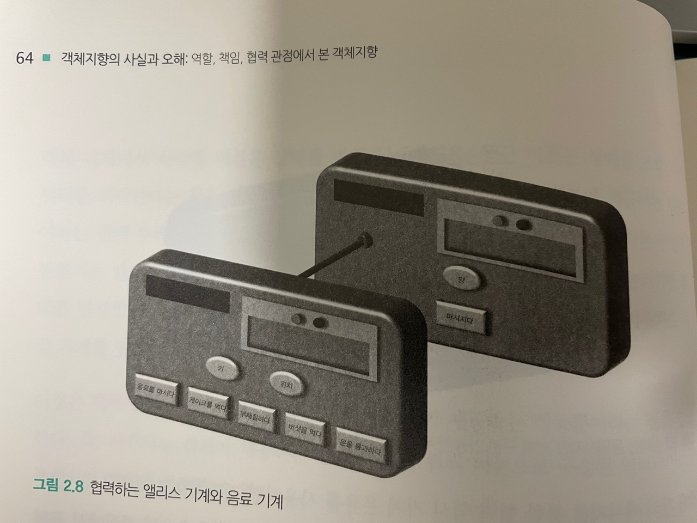

# 02. 이상한 나라의 객체

## 객체지향과 인지 능력

---

객체지향 패러다임은 인간이 인지할 수 있는 다양한 객체들이 모여 현실 세계를 이루는 것처럼 소프트웨어의 세계 역시 인간이 인지할 수 있는 다양한 소프트웨어 객체들이 모여 이뤄져 있다는 믿음에서 출발한다.
 
그러나 현실 세계와 소프트웨어 세계 사이의 유사성은 여기까지일 뿐이다.
  

| 객체   | 현실 세계                                   | 소프트웨어 세계                             |
| ------ | ------------------------------------------- | ------------------------------------------- |
| 전등   | 사람의 손길 없이는 스스로 불을 밝힐 수 없음 | 외부의 도움 없이도 스스로 불을 밝힐 수 있음 |
| 주문   | 사람이 직접 주문 금액을 계산                | 주문 객체가 자신의 금액을 계산              |
| 자동차 | 사람의 손길 없이는 시동을 걸지 못함         | 자동차 객체 스스로 시동을 걸 수 있음        |
| 통장   | 사람이 인출하지 않으면 금액을 찾을 수 없음  | 통장 객체 스스로 금액을 인출할 수 있음      |

  

실행 중인 객체지향 애플리케이션의 내부를 들여다볼 수 있다면 겉으로는 우리가 알고 있는 세계와 유사해 보이지만 본질적으로는 매우 이질적인 모습을 지니고 있다.

---

## 객체, 그리고 소프트웨어 나라

---

객체의 다양한 특성을 효과적으로 설명하기 위해서는 객체의 상태(state), 행동(behavior), 식별자(identify)를 지닌 실체로 보는 것이 가장 효과적이다.

### 1. 상태

- 상태를 이용하면 과거에 얽매이지 않고 현재를 기반으로 객체의 행동 방식을 이해할 수 있다.

상태와 프로퍼티
  
객체의 상태를 구성하는 모든 특징을 통틀어 객체의 프로퍼티(property)라고 한다.
 
일반적으로 프로퍼티는 변경되지 않고 고정되기 때문에 "정적"이다. 반면 프로퍼티 값(property value)은 시간이 흐름에 따라 변경되기 때문에 "동적"이다.
 
결론적으로, 상태는 특정 시점에 객체가 가지고 있는 정보의 집합으로 객체의 구조적 특징을 표현한다. 객체의 상태는 객체에 존재하는 정적인 프로퍼티와 동적인 프로퍼티 값으로 구성된다. 객체의 프로퍼티는 단순한 값과 다른 객체를 참조하는 링크로 구분할 수 있다.

### 2. 행동

#### 2-1. 상태와 행동

객체의 상태는 저절로 변경되지 않는다. 객체의 상태를 변경하는 것은 객체의 자발적인 행동뿐이다.
 
객체의 행동에 의해 객체의 상태가 변경된다는 것은 행동이 부수 효과(side effect)를 초래한다는 것을 의미한다.
  

#### 2-2. 협력과 행동

어떤 객체도 섬이 아니다. 객체는 자신에게 주어진 책임을 완수하기 위해 다른 객체를 이용하고 다른 객체에게 서비스를 제공한다. 객체는 다른 객체와 적극적으로 상호작용하며 '협력하는 객체들의 공동체'에 참여하기 위해 노력한다.
 
결론적으로, 행동이란 외부의 요청 또는 수신된 메시지에 응답하기 위해 동작하고 반응하는 활동이다. 행동의 결과로 객체는 자신의 상태를 변경하거나 다른 객체에게 메시지를 전달할 수 있다. 객체는 행동을 통해 다른 객체와의 협력에 참여하므로 행동은 외부에 가시적이어야 한다.
  

#### 2-3. 상태 캡슐화

객체는 상태를 캡슐 안에 감춰둔 채 외부로 노출하지 않는다. 객체가 외부에 노출하는 것은 행동뿐이며, 외부에서 객체에 접근할 수 있는 유일한 방법 역시 행동 뿐이다.
 
상태를 잘 정의된 행동 집합 뒤로 캡슐화하는 것은 객체의 자율성을 높이고 협력을 단순하고 유연하게 만든다. 이것이 상태를 캡슐화해야 하는 이유다.

### 3. 식별자

객체가 식별 가능하다는 것은 객체를 서로 구별할 수 있는 특정한 프로퍼티가 객체 안에 존재한다는 것을 의미한다. 이 프로퍼티를 식별자라고 한다.
 
식별자란 어떤 객체를 다른 객체와 구분하는 데 사용하는 객체의 프로퍼티다.

- 값은 식별자를 가지지 않기 때문에 상태를 이용한 동등성(equality) 검사를 통해 두 인스턴스를 비교해야 한다.
- 객체는 상태가 변경될 수 있기 때문에 식별자를 이용한 동일성(identical) 검사를 통해 두 인스턴스를 비교할 수 있다.

## 기계로서의 객체

---

객체지향의 세계를 창조하는 개발자들의 주된 업무는 객체의 상태를 조회하고 객체의 상태를 변경하는 것이다.

- 용어 정리
  - 쿼리(query) - 일반적으로 객체의 상태를 조회하는 작업
  - 명령(command) - 객체의 상태를 변경하는 작업
      

버트란드 마이어는 [Object-Oriented-Software-Construction]에서 객체를 우리가 친숙하게 알고 있는 한 가지 사물에 비유해서 설명하고 있다. 바로 기계다.
  
사각형 모양의 버튼을 누르면 객체의 상태를 직접 변경할 수 있다. 사각형 버튼을 누른 시점에는 변경된 상태를 직접 눈으로 볼 수는 없다. 대신 원하는 시점에 원 모양의 버튼을 눌러 객체의 상태를 조회할 수 있다. 객체의 상태는 우측 상단의 디스플레이 창에 출력된다. 좌측 상단의 슬롯은 버튼을 눌러 기계의 상태를 변경하거나 조회할 때 기계가 필요로 하는 추가 정보를 위치시키는 곳이다.
  

> 위 그림은 링크를 통해 연결된 엘리스 객체와 음료 객체를 기계 은유의 관점에서 표현한 것이다. 그림에서 앞에 있는 기계가 엘리스 객체를 표현한 것이고 뒤에 위치한 기계가 음료 객체를 표현한 것이다.

위 이미지에서 사용자가 앞쪽에 있는 엘리스 기계의 '음료를 마시다' 버튼을 눌렀다고 가정하자.
 
엘리스 기계는 내부적으로 키를 작게 변경한 후 링크를 통해 연결된 음료 기계에게 '마셔지다'라는 버튼이 눌려지도록 요청을 전송한다.
 
객체지향 패러다임 관점에서 이것은 '음료를 마시다'라는 메시지를 수신한 엘리스 객체가 메시지를 처리하던 도중 음료 객체에게 '마셔지다'라는 메시지를 전송한 것과 동일하다.
 
즉, 링크를 통해 연결된 두 객체가 메시지 전송을 통해 협력하고 있는 것이다.
  

객체를 기계로서 바라보는 관점은 상태, 행동, 식별자에 대한 시각적인 이미지를 제공하고 캡슐화와 메시지를 통한 협력 관계를 매우 효과적으로 설명한다.

## 행동이 상태를 결정한다

---

- 상태를 먼저 결정하고 행동을 나중에 결정하는 방법은 설계에 나쁜 영향을 준다.
  1. 상태를 먼저 결정할 경우 캡슐화가 저해된다.
  2. 객체를 협력자가 아닌 고립된 섬으로 만든다.
  3. 객체의 재사용성이 저하된다.

객체지향 설계는 애플리케이션에 필요한 협력을 생각하고 협력에 참여하는 데 필요한 행동을 생각한 후 행동을 수행할 객체를 선택하는 방식으로 수행된다. 행동을 결정한 후에야 행동에 필요한 정보가 무엇인지를 고려하게 되며 이 과정에서 필요한 상태가 결정된다.
  
따라서, 먼저 객체의 행동을 결정하고 그 후에 해동에 적절한 상태를 선택하게 된다.
 

협력 안에서 객체의 행동은 결국 객체가 협력에 참여하면서 완수해야 하는 책임을 의미한다. 따라서 어떤 책임이 필요한가를 결정하는 과정이 전체 설계를 주도해야 한다.
 
이 책에서 살펴볼 책임 - 주도 설계(Responsibility-Driven Design, RDD)는 협력이라는 문맥 안에서 객체의 행동을 생각하도록 도움으로써 응집도 높고 재사용 가능한 객체를 만들 수 있게 한다.
  
즉, **"행동이 상태를 결정한다."**

## 은유와 객체

---

### 두 번째 도시전설

- 이 책 1장에서 살펴보았듯 "클래스가 객체지향의 핵심"이 첫 번째 도시전설이다.
- 두 번째 도시전설은 "객체지향이란 현실 세계의 모방"이라는 것이다.

객체지향 세계는 현실 세계의 단순한 모방이 아니다. 소프트웨어 안에 구현된 상품 객체는 실제 세계의 상품과는 전혀 다른 양상을 띤다.
 
소프트웨어 상품은 실제 세계의 상품이 하지 못하는 가격 계산과 같은 행동을 스스로 수행할 수 있다. 이것은 소프트웨어 상품이 실제 세계의 상품을 단순화하거나 추상화한 것이 아니라 특성이 전혀 다른 어떤 것임을 의미한다.
  

### 의인화

- 현실 속의 객체와 소프트웨어 객체 사이의 가장 큰 차이점은 무엇인가?
  - 현실 속에서는 수동적인 존재가 소프트웨어 객체로 구현될 때는 능동적으로 변하는 것.

> 레베카 워프스브룩은 현실의 객체보다 더 많은 일을 할 수 있는 소프트웨어 객체의 특징을 **의인화(anthropomorphism)**라고 부른다.

### 은유

현실 세계와 객체지향 세계 사이의 관계를 좀 더 정확하게 설명할 수 있는 단어는 은유(metaphor)다.

- 은유란?
  - 실제로는 적용되지 않는 한 가지 개념을 이용해 다른 개념을 서술하는 대화의 한 형태이다.

은유는 표현적 차이(representational gap) 또는 의미적 차이(semantic gap)라는 논점과 관련성이 깊다. 여기서 차이란 소프트웨어에 대해 사람들이 생각하는 모습과 실제 소프트웨어의 표현 사이의 차이를 의미한다.

- 모든 객체지향 지침서에는 현실 세계인 도메인에서 사용되는 이름을 객체에게 부여하라고 가이드하는 이유가 뭘까?
  1. 소프트웨어 객체에 대한 현실 객체의 은유를 효과적으로 사용할 경우 표현적 차이를 줄일 수 있다.
  2. 이해하기 쉽고 유지보수가 용이한 소프트웨어를 만들수 있다.

### 이상한 나라를 창조하라

객체지향 설계자로서 우리의 목적은 현실을 모방하는 것이 아니다.
 
여러분이 창조한 객체의 특성을 상기시킬 수 있다면 현실 속의 객체의 이름을 이용해 객체를 묘사하라. 그렇지 않다면 깔끔하게 현실을 무시하고 자유롭게 여러분만의 새로운 세계를 창조하기 바란다.
