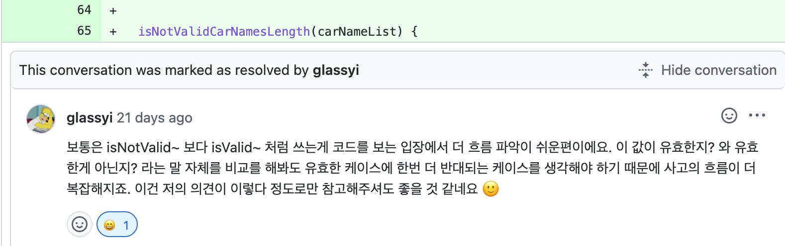

# 부정 조건문 < 긍정 조건문

---

## 나는.. 조건문을 작성할 때 말이지..

---

나는 무의식적으로 조건문을 작성할 때 네이밍을 변경하기 보다는 ! Not 연산자를 이용해 반대되는 값을 찾곤 했다.

예를 들어 빈 값인지 체크하는 경우 isEmpty 함수를 만들었다고 가정하자.
로직이 조금이라도 변경되어 빈 값이 아닌 즉, 값이 있는 경우 참인 조건을 사용해야할 때 !(Not) 부정연산자를 사용해왔다.

!isEmpty...??

<br />

## 클린 코드

---

아직 자바스크립트 기본기가 부족해 클린 코드라는 책을 읽어보지는 못했다.. 추후 읽어야 하지만 클린 코드 도서 안의 내용을 인용하자면 일반저으로 부정 조건문 보다 긍정 조건문이 읽기 편하다고 한다.

### 👎🏼 예시

---

```javascript
if (!this.isPositiveMoney) {
}

if (!this.isEmpty) {
}

if (!this.personA.isOlderThan(personB)) {
}
```

### 👍🏼 예시

---

```javascript
if (this.isNegativeMoney) {
}

if (this.hasContent) {
}

if (this.personA.isYongerThan(personB)) {
}
```

<br />

## 포코가 읽어본 크루들의 코드에 대한 생각!

---

포코 말을 인용하자면 사람이 생각하는 흐름으로 보았을 때
`if () { 참일 때 실행 } else { 거짓일 때 실행}` 으로 흐르게 되는데,
반대로 `if() { 거짓일 때 실행 } else { 참일 때 실행}` 이처럼 사람이 이해하는 로직의 반대로 코드를 작성할 경우 코드를 읽을때 상당히 헷갈림이 온다고 한다.

물론 예외 상황은 존재한다고 하셨다!

포코가 크루들 코드를 보며 가장 헷갈렸다는 예시 목록이다..

- !isNaN
- isNotNaN
- !isEmptyXXX
- isNotEmpty

내가 작성한 코드를 가져다 놓은 것 같다.. 포코의 말이 맞다..
문자형이면 문자형 불리언이면 불리언이지.. 숫자형이 아닌게 아니다..??
빈 것이 아니다..??

코드를 읽어나가는데 한 번, 두 번, 세 번 더 생각하게 된다.. 😵‍💫

**부정 조건문을 무조건적으로 피하는건 아니지만, 되도록 지양하자..** 가슴깊게 새겨본다.



나는 이 피드백을 받았을 당시에도 나는 `isNotValid`를 `!isValid`로 변경했었다..
피드백을 도대체 어디로 알아먹은것인지..
`isNotValid`와 `!isValid`는 동일하다..

**부정 조건문을 무조건적으로 피하는건 아니지만, 되도록 지양하자..** 다시 한 번 가슴 깊게 새겨보자.

<br />

> 참고: [참고 블로그](https://schneide.blog/2014/08/03/dont-ever-not-avoid-negative-logic/)
