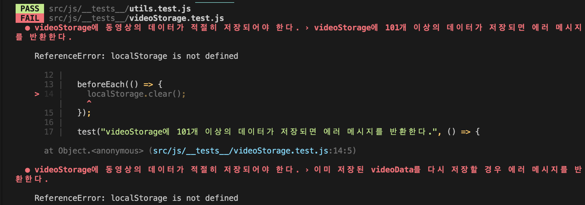
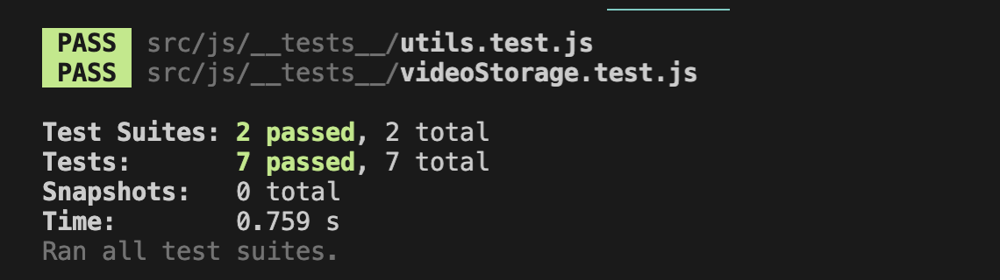

# jest 테스트 코드 작성시 마주하게 된 문제...

---

## 1. 발생한 문제.. 😡

---

나만의 유튜브 강의실 미션중 마주한 문제이다...
test 코드를 작성하고, 기능을 구현하고... 를 하던 중!
미션에서 사용중인 localStorage, fetch를 사용한 코드를 jest에서 test 하게 된다면..

짠...!



ReferenceError 코드를 보면 localStorage is not defined를 볼 수 있다..
localStorage가 없을 수 없는데.... 정의되지 않았다니...??! 🤯

## 2. 해결하기 위해..😵‍💫

---

우선 이전에 jest와 cypress를 동시에 사용했을 때, error가 발생하면서 찾아보았던 자료중 jest는 가상의 jsDOM 이용해 test 코드를 확인한다고 했었다..!

따라서, jest는 node 환경에서 동작하는 친구이기 때문에.. window API인 localStorage를 찾을 수가 없는 것이다.

localStorage를 mocking 할 수 있는 방법이 없을까..?! 고민하며 구글링을 한 결과


npm에 jest-localStorage-mock 이라는 패키지가 있다는 것을 확인할 수 있었다!

npm 공식문서에 설명을 간단히 요약하자면

1. jest를 devDependency로 설치한다.

```bash
npm install -D jest-localStorage-mock
```

2. package.json 파일에 jest configuration 영역을 만든 후 setupFiles와 resetMocks을 설정해준다.

```json
{
  "jest": {
    "resetMocks": false,
    "setupFiles": ["jest-localStorage-mock"]
  }
}
```

끗!

생각보다 간단하다!

추가로 이렇게 설정했는데 error가 발생할 경우

아래 명령어를 터미널에서 실행 시키면 정상적으로 동작할 것이다!

```bash
npx jest
```

## 3. 정상적으로 동작!! 😎

---

짜잔!



아! 추가적으로 fetch를 사용한 경우도 동일한 오류가 발생하는데,
해결방법은 여러가지가 있지만
jest-fetch-mock도! 존재한다는 것을 알고 계시면 도움이 되실 것 같다!

구글링을 하면 쉽게 찾을 수 있는 문제이지만... 혹시나 localStorage 때문에 머리가 아프신 분들이 이 글을 보고 문제를 해결할 수 있으면 좋겠다!!!
