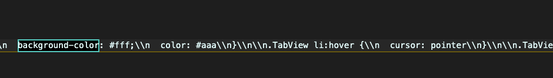
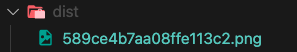

# 자주 사용하는 로더

---

로더의 종류는 많지만 자주 사용되는 로더 4가지에 대해 알아보려 한다.

## 4.1 css-loader

---

웹팩은 모든 것을 모듈로 바라보기 때문에 자바스크립트 뿐만 아니라 스타일 시트도 import 구문으로 불러올 수 있다.

```javascript
// app.js
import "./style.css";
```

<br />

### 1. css-loader를 설치한다.

```bash
npm install -D css-loader
```

<br />

### 2. webpack.config.js 파일에 module을 추가한다.

```javascript
module.exports = {
  module: {
    rules: [
      {
        test: /.css$/,
        use: ["css-loader"],
      },
    ],
  },
};
```

webpack.config.js 파일안에 module.exports 프로퍼티로 module을 추가한 후 module의 프로퍼티로 rules를 추가한다.
<br />
rules는 다른 로더들이 추가적으로 설치될 수 있으니 배열 형태로 작성해주는게 좋다.
<br />

- webpack.config.js에 옵션 내용은 css로 끝나는 모든 파일들을 css-loader로 사용하겠다는 의미다.

<br />
설정이 끝났다면 터미널에서 build를 한 후 dist 폴더를 가보면 아래와 같이 javascript 파일에 css가 삽입되어있는 것을 확인할 수 있다.


<br /><br />

## 4.2 style-loader

---

style-loader와 css-loader는 같이 사용한다.
<br />
모듈로 변경된 스타일 시트는 돔에 추가되어야만 브라우저가 해석할 수 있기 때문이다. css-loader로 처리하면 자바스크립트 코드로만 변경되었을 뿐 돔에 적용되지 않았기 때문에 스타일이 적용되지 않는다.
<br /><br />
style-loader는 자바스크립트로 변경된 스타일을 동적으로 돔에 추가하는 로더이다. CSS를 번들링하기 위해서는 css-loader와 style-loader를 같이 사용해야 한다.
<br /><br />

### 1. style-loader를 설치한다.

```bash
npm install -D style-loader
```

### 2. webpack.config.js 파일에 module을 추가로 작성한다.

```javascript
module.exports = {
  module: {
    rules: [
      {
        test: /\.css$/,
        use: ["style-loader", "css-loader"],
      },
    ],
  },
};
```

<br />

기존에 작성했던 use에 style-loader를 추가 작성해준다. 이때 주의할 점은 webpack이 use를 뒤에서부터 읽어 오기 때문에 "style-loader", "css-loader"를 순서에 맞게 적어주어야 한다.

<br /><br />

## 4.3 file-loader

---

웹팩을 사용하면 CSS 뿐만 아니라 소스코드에서 사용하는 모든 파일을 모듈로 사용하게끔 할 수 있다. 파일을 모듈 형태로 지원하고 웹팩의 아웃풋에 파일을 옮겨주는 것이 바로 file-loader가 하는 일이다.
<br />
예를 들어 CSS에서 url()함수에 이미지 파일 경로를 지정하는 경우 웹팩은 이 이미지 파일을 file-loader를 이용해서 처리한다.
<br /><br />

### 1. file-loader를 설치한다.

```bash
npm install -D file-loader
```

### 2. webpack.config.js에 module을 추가 작성한다.

```javascript
module.exports = {
  module: {
    rules: [
      {
        test: /\.css$/,
        use: ["style-loader", "css-loader"],
      },
      {
        test: /\.png$/,
        use: "file-loader",
        options: {
          publicPath: "./dist/",
          name: "[name].[ext]?[hash]",
        },
      },
    ],
  },
};
```

<br />

위와 같이 webpack.config.js 에 module을 추가하면 웹팩이 .png 파일을 발견하면 file-loader를 실행한다. 로더가 동작하고 나면 아웃풋에 설정한 경로로 이미지 파일이 복사된다.
<br />
이때, options에 publicPath와 name을 작성하지 않으면 파일이 제대로 불러와지지 않는다. 이유는 아래 그림과 같이 dist 폴더에 이미지 파일명이 해쉬 코드로 변경되어 들어와 있기 때문이다.
<br /><br />



<br />
publicPath 옵션은 file-loader가 처리하는 파일을 모듈로 사용할 때 경로 앞에 추가되는 문자열이다.
<br />
output에 설정한 'dist' 폴더에 이미지 파일을 옮길 것이므로, publicPath 값을 "./dist/"로 지정했다. 
<br />
output에 설정한 폴더 이름이 dist가 아닌경우는 해당하는 파일과 경로로 설정해주어야 한다.
<br /><br />
또한, name 옵션을 사용했는데 이것은 로더가 파일을 아웃풋에 복사할때 사용하는 파일 이름이다. 기본적으로 설정된 해쉬값을 쿼리스트링으로 옮겨서 'bg.png?{해쉬 코드}' 형식으로 파일을 요청하도록 설정한 것이다.
<br /><br />

## 4.4 url-loader

---

사용하는 이미지 갯수가 많다면 리소스를 사용하는 부담이 있고 사이트 성능에 영향을 줄 수도 있다.
<br />
만약 한 페이지에서 작은 이미지를 여러 개 사용한다면 Data URI Scheme을 이용하는 방법이 더 나은 경우도 있다. 이미지를 Base64로 인코딩하여 문자열 형태로 소스코드에 넣는 형식이다.
<br /><br />

이와 같은 처리를 자동화 하는게 url-loader이다.

### 1. 먼저 url-loader를 설치한다.

```bash
npm install -D url-loader
```

### 2. webpack.config.js에 module을 추가 작성한다.

기존에 file-loader를 작성한 부분을 변경해주어야 한다.

```javascript
module.exports = {
  module: {
    rules: [
      {
        test: /\.css$/,
        use: ["style-loader", "css-loader"],
      },
      {
        test: /\.png$/,
        use: {
          loader: "url-loader",
          options: {
            publicPath: "./dist/",
            name: "[name].[ext]?[hash]",
            limit: 5000,
          },
        },
      },
    ],
  },
};
```

file-loader와 옵션 설정은 거의 비슷하다. limit 속성만 추가된다고 생각해주면 된다.
<br />
limit 속성의 5000은 모듈로 사용한 파일중 크기가 5kb미만인 파일만 url-loader를 적용하는 설정이다. 만약 이보다 크면 file-loader가 처리하는데 옵션 중 fallback 기본값이 file-loader이기 때문이다.
<br /><br />
fallback의 default값이 file-loader이기 때문에 따로 설정을 하지 않아도 된다.
<br /><br />

- 아이콘과 같이 용량이 작거나 사용 빈도가 높은 이미지는 파일을 그대로 사용하기 보다는 Data URI Scheeme를 적용하기 위해 url-loader를 사용하는 편이 좋다.
