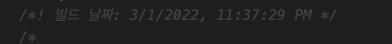
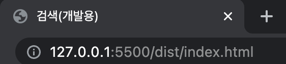

# 자주 사용하는 플러그인

---

## 0. 플러그인의 역할

---

로더가 파일 단위로 처리하는 반면 플러그인은 번들된 결과물을 처리한다.
<br />
번들된 자바스크립트를 난독화 한다거나 특정 텍스트를 추출하는 용도로 사용한다.
<br /><br />

## 1. BannerPlugin

---

BannerPlugin을 사용하면 결과물에 빌드 정보나 커밋 버전같은 걸 추가할 수 있다.
<br />

### 1. webpack.config.js 파일에 plugins를 추가한다.

BannerPlugin은 webpack을 설치하면 webpack에 내장되어 있는 메서드를 활용해 사용할 수 있으니, 별도의 설치는 필요하지 않다.

<br />

```javascript
const webpack = require("webpack");

module.exports = {
  plugins: [
    new webpack.BannerPlugin({
      banner: `빌드 날짜: ${new Date().toLocaleString()}`,
    }),
  ],
};
```

<br />

빌드된 결과는 아래와 같이 나온다.
<br />


<br /><br />

베너에 작성할 정보가 많다면 파일을 분리해서 관리해줄 수 있다.

```javascript
// banner.js
module.exports = function banner() {
  const commit = childProcess.execSync("git rev-parse --short HEAD");
  const user = childProcess.execSync("git config user.name");
  const date = new Date().toLocaleString();

  return (
    `commitVersion: ${commit}` + `Build Date: ${date}\n` + `Author: ${user}`
  );
};
```

```javascript
// webpack.config.js
const banner = require("./banner.js");
const webpack = require("webpack");

module.exports = {
  plugins: [new webpack.BannerPlugin(banner)],
};
```

## 2. DefinePlugin

---

어플리케이션은 개발환경(development)과 운영환경(production)으로 나누어서 운영한다.
<br />
가령 환경에 따라 API 서버 주소가 다를 수 있다. 같은 소스 코드를 두 환경에 배포하기 위해서는 이러한 환경 의존적인 정보를 소스가 아닌 곳에서 관리하는 것이 좋다.
<br />
배포할 때마다 코드를 수정하는 것은 곤란하기 때문이다.
<br /><br />

웹팩은 이러한 환경 정보를 제공하기 위해 DefinePlugin을 제공한다.
<br />

### 1. webpack.config.js에 plugins를 추가 작성한다.

DefinePlugin도 BannerPlugin과 마찬가지로 webpack을 설치하면 webpack 안에 메서드로 존재하기 때문에 추가 설치를 하지 않아도 된다.

```javascript
const webpack = require("webpack");

module.exports = {
  plugins: [
    new webpack.BannerPlugin({
      banner: `빌드 날짜: ${new Date().toLocaleString}`,
    }),
    new webpack.DefinePlugin({}),
  ],
};
```

<br />

webpack.DefinePlugin에 빈 객체를 인자로 전달하는데, 빈 객체를 전달하더라도 기본적으로 넣어주는 값이 존재한다. 노드 환경정보인 process.env.NODE_ENV 인데 웹팩 설정의 mode에 설정한 값이 여기에 들어간다.
<br /><br />

development로 설정했다면 process.env.NODE_ENV 변수로 접근하면 development 값을 얻을 수 있고, production으로 설정정했다면 production 값을 얻을 수 있다.
<br /><br />

이 외에도 웹팩 컴파일 시간에 결정되는 값을 전역 상수 문자열로 어플리케이션에 주입할 수 있다.
<br />

```javascript
// webpack.config.js

new webpack.DefinePlugin({
  TWO: "1+1",
});
```

TWO라는 전역 변수에 1+1이라는 코드 조각을 넣었다. 이는 실제 어플리케이션 코드에서 출력하게 된다면 2가 나온다.

```javascript
// app.js

console.log(TWO);
```

코드가 아닌 값을 입력하고 싶을 경우에는 JSON.stringify 를 사용해 문자열화 해서 설정해주면 된다.

```javascript
// webpack.config.js

new webpack.DefinePlugin({
  VERSION: JSON.stringify("v.1.2.3"),
  PRODUCTION: JSON.stringify(false),
  MAX_COUNT: JSON.stringify(999),
  "api.domain": JSON.stringify("http://dev.api.domain.com"),
});
```

- 빌드 타임에 결정된 값을 어플리케이션에 전달해야할 경우 DefinePlugin을 사용하자.

<br /><br />

## 3. HtmlWebpackPlugin

---

HtmlWebpackPlugin은 HTML을 후처리하는데 사용한다. 빌드 타임의 값을 넣거나 코드를 압축할 수 있다.

### 1. 먼저 html-webpack-plugin을 설치한다.

```bash
npm install -D html-webpack-plugin
```

### 2. webpack.config.js 에 plugin을 추가한다.

```javascript
const webpack = require("webpack");
const HtmlWebpackPlugin = require("html-webpack-plugin");

module.exports = {
  plugins: [
    new webpack.BannerPlugin({
      banner: `빌드 날짜: ${new Date().toLocaleString}`,
    }),
    new webpack.DefinePlugin({}),
    new HtmlWebpackPlugin({
      template: "./index.html",
      templateParameters: {
        env: process.env.NODE_ENV === "development" ? "(개발용)" : "",
      },
    }),
  ],
};
```

- template 옵션에 index.html 파일의 경로를 작성한다. (src안에 있을 경우는 './src/index.html'로 작성해주면 된다.)
- templateParameters 객체 안에 env라는 프로퍼티를 생성해 값을 설정하는데, `process.env.NODE_ENV` 가 development일 경우와 production일 경우 "(개발용)", ""으로 값이 설정되게 만든다.

```html
<head>
  <title>타이틀<%= env %></title>
</head>
```

타이틀 부분에 ejs 문법을 이용하는데 `<%= env %>`는 전달받은 env 변수 값을 출력한다.
<br />
HtmlWebpackPlugin은 이 변수에 데이터를 주입시켜 동적으로 HTML 코드를 생성할 수 있다.

위 예제는 `process.env.NODE_ENV`가 "develpoment"일 경우 `타이틀(개발용)`이 출력되고, "production"일 경우는 `타이틀`이 출력된다.



<br /><br />

또한, 웹팩으로 빌드한 결과물을 자동으로 로딩하는 코드를 주입해주기 때문에 HTML에 `<script>` 태그를 제거해도 정상적으로 동작한다.
<br /><br />

개발 환경과 달리 운영 환경에서는 파일을 압축하고 불필요한 주석을 제거해주는게 좋다.
<br />
이것 또한 HtmlWebpackPlugin으로 설정해줄 수 있다.

```javascript
const webpack = require("webpack");
const HtmlWebpackPlugin = require("html-webpack-plugin");

module.exports = {
  plugins: [
    new webpack.BannerPlugin({
      banner: `빌드 날짜: ${new Date().toLocaleString}`,
    }),
    new webpack.DefinePlugin({}),
    new HtmlWebpackPlugin({
      template: "./index.html",
      templateParameters: {
        env: process.env.NODE_ENV === "development" ? "(개발용)" : "",
      },
      minify:
        process.env.NODE_ENV === "production"
          ? {
              collapseWhiteSpace: true,
              removeComments: true,
            }
          : false,
      hash: true,
    }),
  ],
};
```

<br />

`minify` 옵션에 `process.env.NODE_ENV`가 "production"일 경우 `collapseWhiteSpace: true`로, `removeComments: true`로 설정하고 "development"일 경우 `false`로 설정했다.
<br /><br />

위 옵션을 설정하면 환경 변수가 "production"일 경우 주석과 공백을 제거해주고,
<br />
환경 변수가 "development"일 경우는 주석과 공백을 읽기 좋게 살려준다.
<br />

또한 `hash: true`로 설정하면 빌드할 시 생성하는 해쉬값을 정적파일 로딩 주소의 쿼리 문자열로 붙여서 HTML을 생성하는데, 정적파일을 배포하면 즉각 브라우져에 반영되지 않는 문제를 예방할 수 있다.

<br /><br />

## 4. CleanWebpackPlugin

---

CleanWebpackPlugin은 빌드 이전의 결과물을 제거하는 플러그인이다. 빌드 결과물은 아웃풋 경로에 모이는데 과거 파일이 남아 있을 수 있다. 이전 빌드내용이 덮여씌여지면 상관없지만 그렇지 않으면 아웃풋 폴더(dist)에 여전히 남아있을 수 있다.

### 1. 먼저 CleanWebpackPlugin을 설치하자.

```bash
npm install -D clean-webpack-plugin
```

### 2. webpack.config.js에 plugin을 추가하자.

```javascript
const { CleanWebpackPlugin } = require("clean-webpack-plugin");

module.exports = {
  plugins: [
    new webpack.BannerPlugin({
      banner: `빌드 날짜: ${new Date().toLocaleString}`,
    }),
    new webpack.DefinePlugin({}),
    new HtmlWebpackPlugin({
      template: "./index.html",
      templateParameters: {
        env: process.env.NODE_ENV === "development" ? "(개발용)" : "",
      },
      minify:
        process.env.NODE_ENV === "production"
          ? {
              collapseWhiteSpace: true,
              removeComments: true,
            }
          : false,
      hash: true,
    }),
    new CleanWebpackPlugin();
  ]
}
```

CleanWebpackPlugin은 {}를 사용해서 require를 해줘야한다.
<br />
또한 인자로 아무런 값을 전달하지 않아도 빌드할 때 아웃풋 폴더(dist)를 모두 삭제한 후 새로운 빌드 결과를 생성한다.
<br /><br />

## 5. MiniCssExtractPlugin

---

프로젝트가 커지면서 스타일시트가 많아지면 하나의 자바스크립트 결과물로 만드는 것이 부담일 수 있다. 이런 경우 번들 결과에서 스타일시트 코드만 뽑아서 별도의 CSS 파일로 만들어 역할에 따라 파일을 분리해주는게 좋다.
<br />
브라우저에서 큰 파일 하나를 내려받는 것 보다, 여러 개의 작은 파일을 동시에 다운로드하는 것이 더 빠르고 효율적이다.
<br /><br />
development 환경에서는 CSS를 하나의 모듈로 처리해도 상관없지만, production 환경에서는 분리하는 것이 효과적이다.
<br />
이러한 처리를 해주는 plugin이 MiniCssExtractPlugin이다.
<br />

### 1. 먼저 MiniCssExtractPlugin을 설치하자!

```bash
npm install -D mini-css-extract-plugin
```

### 2. webpack.config.js에 plugins을 추가하자!

```javascript
const MiniCssExtractPlugin = require("mini-css-extract-plugin");

module.exports = {

  module: {
    rules: [
      {},
      {
        test: /\.css$/,
        use: [
          process.env.NODE_ENV === 'production' ? MiniCssExtractPlugin.loader : 'style-loader', 'css-loader',
        ]
      }
    ]
  },
  plugins: [
        new webpack.BannerPlugin({
      banner: `빌드 날짜: ${new Date().toLocaleString}`,
    }),
    new webpack.DefinePlugin({}),
    new HtmlWebpackPlugin({
      template: "./index.html",
      templateParameters: {
        env: process.env.NODE_ENV === "development" ? "(개발용)" : "",
      },
      minify:
        process.env.NODE_ENV === "production"
          ? {
              collapseWhiteSpace: true,
              removeComments: true,
            }
          : false,
      hash: true,
    }),
    new CleanWebpackPlugin();
    ...(process.env.NODE_ENV === "production"
      ? [new MiniCssExtractPlugin({ filename: `[name].css` })]
      : []),
  ],
};
```

<br />
MiniCssExtractPlugin은 production 환경일 때만 사용하고 filename을 [name].css로 사용하겠다고 설정한 것이다.
<br /><br />
또한, module의 rules도 수정을 해줘야한다. production 환경일 경우 MiniCssExtractPlugin.loader를 사용하고 development 환경일 경우 'style-loader', 'css-loader'를 사용하겠다고 설정한 것이다.
