# 1단계 리뷰어 피드백 리마인드

## Test코드를 작성할 때는 dscribe를 활용해 단락을 나눠주는게 좋다.

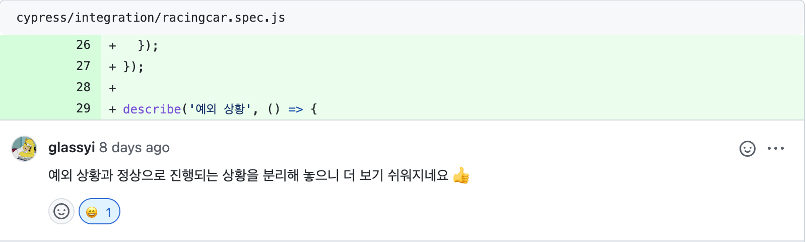

- 이번 미션 테스트 코드는 "예외 상황", "기능 구현", "로딩"으로 구분하여 작성했다.
- 해당하는 섹션별로 정리하면 유지보수가 한결 수월해지는 것 같다.

## 필요하지 않는 주석, console.log는 항상 제거한다.

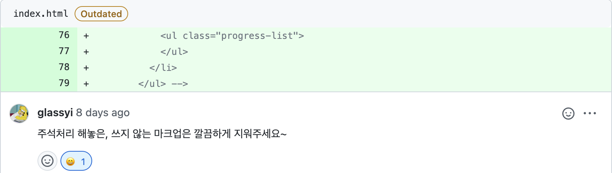

- PR전 필요하지 않는 주석과 console.log가 남아있는지 확인을 꼼꼼히 하는게 좋을 것 같다. 실수하기 쉬운 부분인 것 같으니 다시 한 번 리마인드가 필요할 것 같다.

## 사용자가 어떤 예외상황인지 알 수 있도록 친절하게 작성한다.

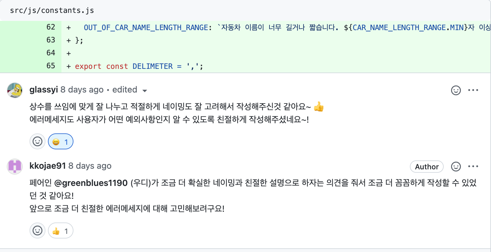

- 평소에는 에러메시지에 대해서 깊이 있는 고민을 하지 않고 작성해왔었던 것 같다.
- 페어인 우디가 에러메시지는 사용자의 입장에서 알아보기 쉽고 친절하게 작성하는것이 좋을 것 같다 했고, 그렇게 작성한 결과 피드백을 보고 기분이 좋았다.
- 앞으로 에러메시지를 작성할 때는 한 번더 생각해보고 작성할 수 있는 좋은 습관이 생긴것 같다.

## template 변수는 상수가 아니다!

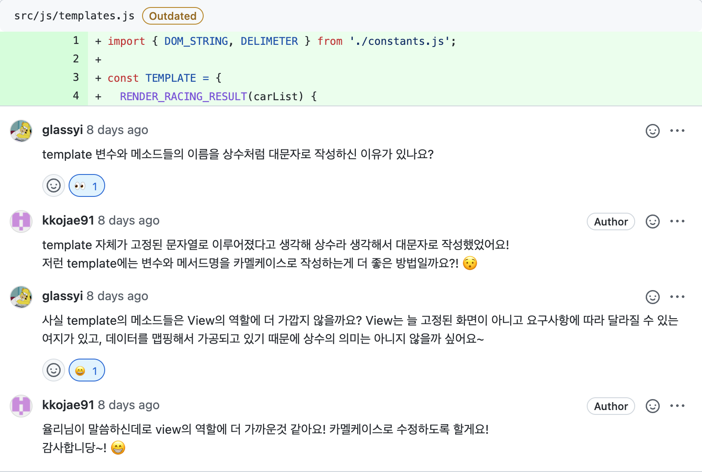

- 평소에 나는 template 변수는 문자열로 이루어져 있으니 당연하게 상수라고 생각하고 상수를 관리하는 파일에서 export하여 사용해왔었다.
- 율리님이 말씀해주신것 처럼 요구사항에 따라 변화할 수 있고, 데이터를 맵핑해서 가공하는 것은 상수로 보기 어렵다.

## heading 태그는 제목의 단계를 뛰어서 작성하지 않는다.

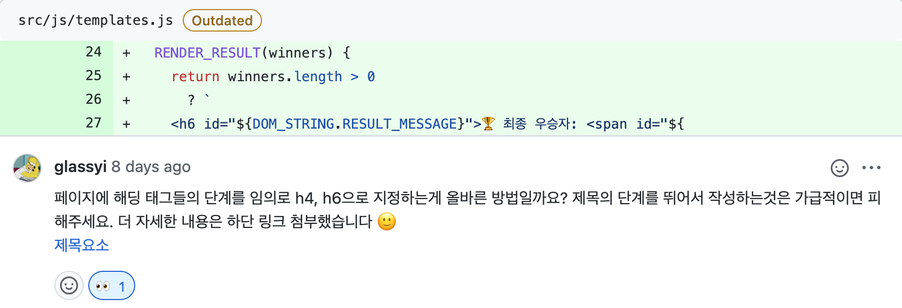

- 글씨 크기를 위해 제목 태그를 사용하지 않는다. 글씨 크기는 CSS의 font-size 속성을 이용한다.

- 제목 단계를 건너뛰는 것을 피하자. 언제나 `<h1>`으로 시작해서, `<h2>` 순차적으로 기입해야 한다.

- 페이지 당 하나의 `<h1>`만 사용해라. 여러개를 써도 오류가 나지는 않지만, 단일 `<h1>`이 모범 사례로 꼽힌다. 논리적으로 생각했을 때도, `<h1>`은 가장 중요한 제목이므로 전체 페이지의 목적을 설명해야 할 것입니다. 두 개의 제목을 가진 책이나, 여러 개의 이름을 가진 영화는 볼 수 없듯이 말이다.

- 스크린 리더 사용자가 흔히 사용하는 탐색 기법은 제목에서 제목으로 뛰어넘으며 페이지 콘텐츠를 빠르게 파악하는 것입니다. 따라서 제목 단계를 뛰어넘으면 중간에 빠진 제목이 어디 있는 건지 모르므로 사용자의 혼란을 야기할 수 있습니다.

> [MDN \<h1\> ~ \<h6\>: HTML 구획 제목 요소](https://developer.mozilla.org/ko/docs/Web/HTML/Element/Heading_Elements)

## 함수명은 한 번에 알아볼 수 있게 작성한다.

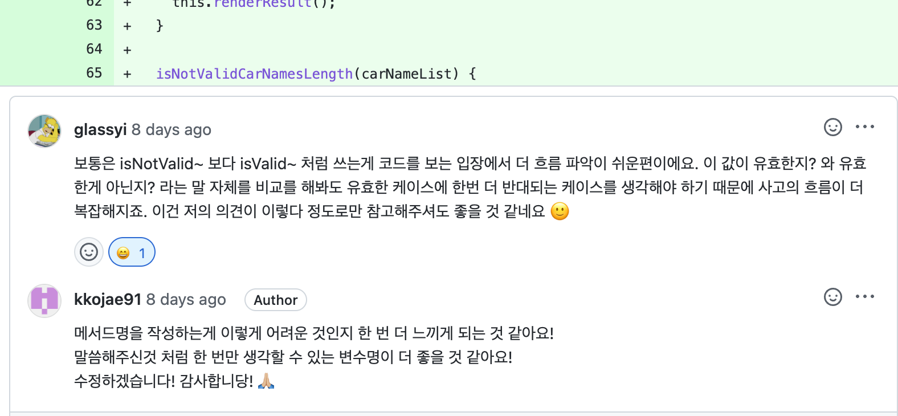

- isNotValid와 isValid를 보면 이 값이 유효하지 않은지? 와 이 값이 유효한지? 로 해석이 된다. isNotValid를 사용할 경우 이 값이 유효하지 않은지? 로 생각을 해야하기 때문에 흐름 파악이 isValid가 더 쉬운편이라고 한다. (이부분은 사람마다 다를 수 있는 부분이라고 생각이 든다.) 하지만, 나도 isNotValid~ 보다는 isValid로 통일하면 흐름을 파악하는데 더 수월할 수 있다고 생각이 들어 isValid로 수정했다.

## 하나의 함수는 하나의 일만 수행한다.

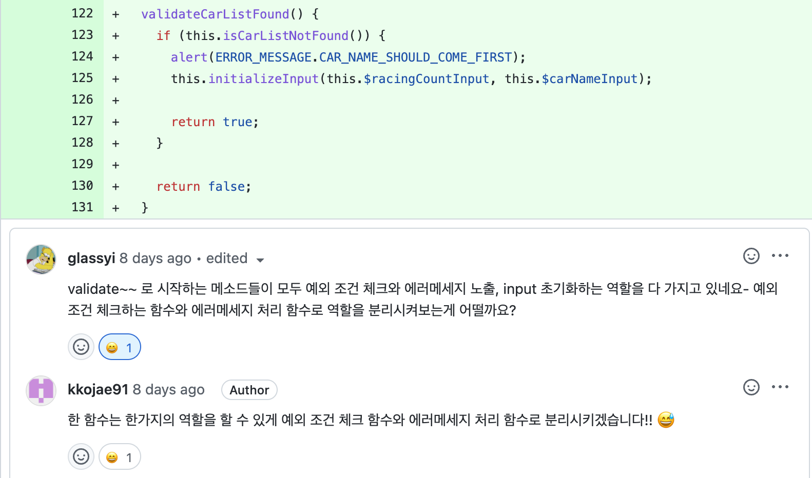

- 나는 이부분에서 의문이 생겼다. 단순히 alert메시지를 띄우는 것인데, alertMessage라는 함수를 만들어서 사용하는게 맞는 것인지...?

- 위의 코드는 아래와 같이 수정했었다.

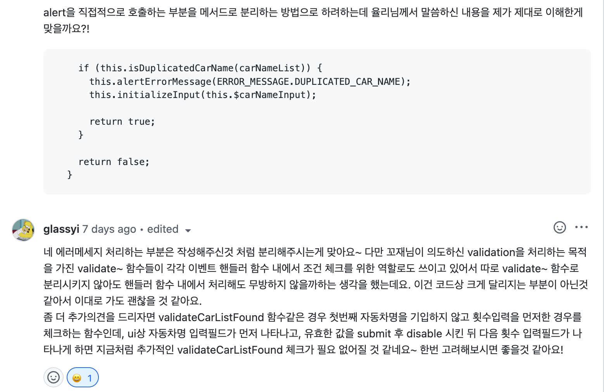

- 단순히 alert을 띄우는 함수더라도 생성해서 alert을 띄우는 역할에 충실한 함수를 사용하는게 좋다. 하나의 함수에서는 하나의 일만 할 수 있도록 만들자!

- step2 미션을 진행하면서 step1 해당하는 피드백을 반영하여 validate~ 함수를 여러개로 분리하지 않고 하나의 함수안에서 처리하도록 변경했다.

## 값이 중복되는지 확인할 때는 Set을 사용한다.

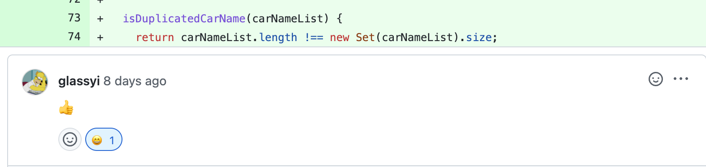

- 중복 값 체크는 반복문을 사용하는게 아니라 set을 통해 간단하게 비교할 수 있다.

## class 선택자 네이밍도 명확하게 작성한다.

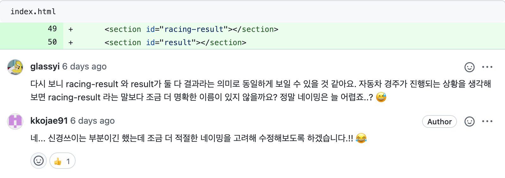

- racing-result와 result는 의미가 모호한 부분이 있다.

- racing-result는 레이싱 과정을 보여주는 section이므로 racing-progress로 변경했고, result는 경기 결과를 보여주는 section이므로 racing-result로 클래스 선택자 명을 변경했다.

## MVC 패턴 적용!

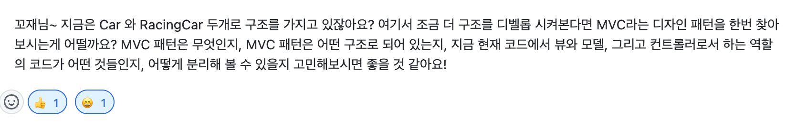

- MVC 패턴.. 이라는 단어는 알고 있고 정리한다고 정리했었던 적이 있지만, 아직 나에게는 Model, View, Controller의 개념이 명확히 정립되어있지 않다고 생각했었다. 이번 기회에 MVC 패턴을 정리 해보려한다.

### MVC 패턴이란?

> [내가 이해한 MVC 디자인 패턴 보러가기](https://kkojae.tistory.com/5)

## innerHTML을 지양하자!

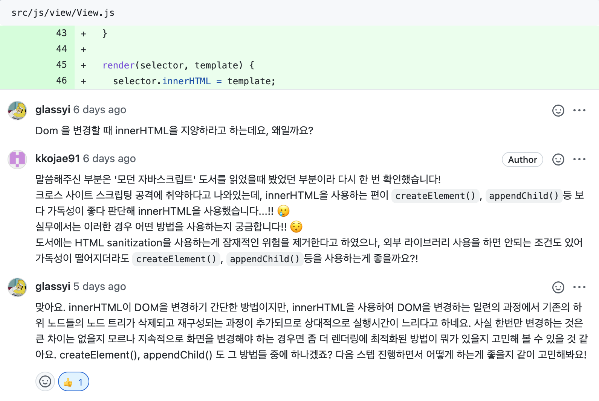

### DOM을 변경할 때 innerHTML을 지양해야하는 이유는?

> [innerHTML을 지양하자!! 보러가기](https://kkojae.tistory.com/6)

## addEventListener에 callback 함수를 사용하자!

STEP2 공통 피드백에서도 다뤘던 부분이다.

- 예) 👎🏼

  - 해당하는 방식으로 사용한다면, 이벤트 바인딩을 끊어야 할 경우 익명함수이기 때문에 곤란하다..

  ```javascript
  element.addEventListener("submit", () => {
    // do something...
  });
  ```

- 예) 👍🏼

  ```javascript
  element.addEventListener("submit", someFunction);

  element.removeEventListener("submit", someFunction);
  ```

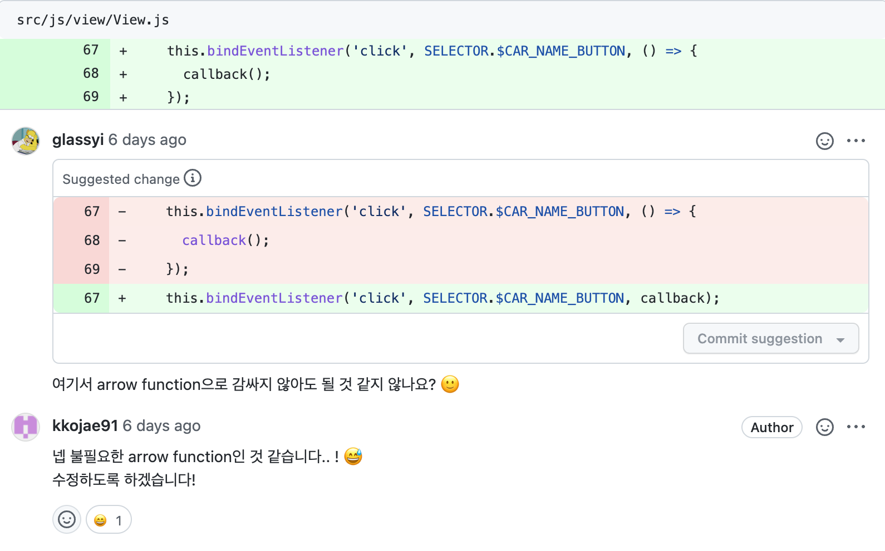

- 이번 미션에서는 이벤트 바인딩을 끊을 이유는 없지만 콜백함수 안에서 콜백함수를 호출만 하는데 굳이 arrow function으로 감싸지 않아도 된다...

- addEventListener와 removeEventListener는 추후 정리해봐야겠다.

> [자동차 경주 게임 STEP1 PR Link](https://github.com/woowacourse/javascript-racingcar/pull/92)
